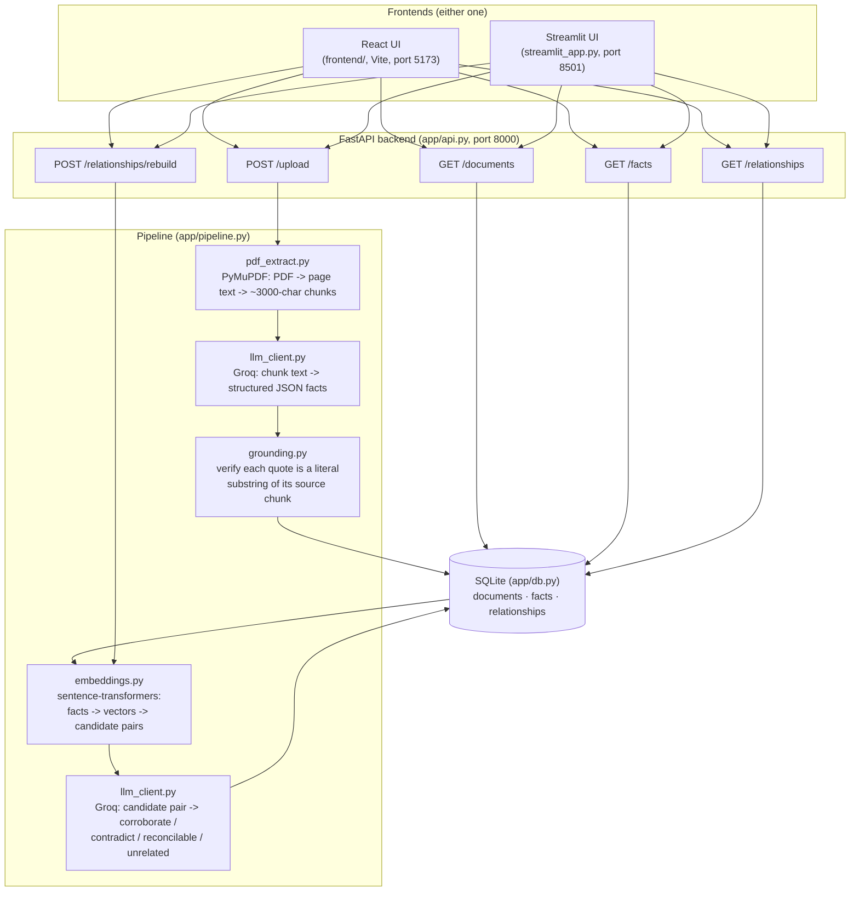

# Fact Knowledge Layer

Extracts checkable facts from PDFs, grounds every fact in a verbatim quote + page number,
and uses Groq to judge how facts across different documents relate: **corroborate**,
**contradict**, or are **reconciled** by context (time, scope, units).

Built for the Superjoin VIT 2026 Engineering Intern assignment.

---

## Setup and Run Instructions

**Requirements:** Python 3.10+, Node.js 18+, and a Groq API key ([console.groq.com](https://console.groq.com)).

### 1. Backend (required — both UIs depend on it)

```bash
git clone <your-repo-url>
cd fact-knowledge-layer/project

python -m venv .venv
.venv\Scripts\Activate.ps1        # Windows PowerShell
# source .venv/bin/activate       # Mac/Linux

pip install -r requirements.txt

cp .env.example .env
# open .env and paste your real key into GROQ_API_KEY=

uvicorn app.api:app --reload --port 8000
```

Leave this running — it's the API everything else talks to (`http://localhost:8000`).

### 2. Frontend — pick one

**Option A: React UI (recommended, used in the demo video)**

```bash
cd frontend
npm install
npm run dev
```

Opens at `http://localhost:5173`. Upload a PDF, watch facts extract, and browse the
**Facts**, **Relationships**, and **Four Required Cases** tabs.

**Option B: Streamlit UI (simpler, no Node.js needed)**

```bash
cd project
.venv\Scripts\Activate.ps1
python -m streamlit run streamlit_app.py
```

Opens at `http://localhost:8501`. Same backend, same data, a plainer interface.

### Processing a PDF from the command line instead

```bash
cd project
python -c "from app.pipeline import process_document; print(process_document('/path/to/file.pdf', 'file.pdf'))"
```

### API reference (if you'd rather skip both UIs)

- `POST /upload` — multipart file upload; runs extraction + relationship discovery, returns fact/relationship counts
- `GET /documents` — list ingested documents
- `GET /facts` — list all facts (each includes `quote_verified`)
- `GET /relationships?relation=corroborate|contradict|reconcilable` — list relationships, optionally filtered
- `POST /relationships/rebuild` — re-run relationship discovery over all current facts

---

## Video Demo


https://github.com/user-attachments/assets/f88a401f-5a5b-414e-bc3c-dfb65dfe0558


---

## Approach

### Architecture



**Data flow in one line:** `PDF → page text → chunks → Groq extracts facts → grounding
check → SQLite → local embeddings find candidate cross-document pairs → Groq classifies
each pair → SQLite → either UI queries it back out.`

### Component breakdown

| File | Responsibility |
|---|---|
| `app/pdf_extract.py` | PyMuPDF: PDF → page-level text → fixed-size chunks with page numbers attached |
| `app/llm_client.py` | Thin OpenAI-SDK wrapper pointed at Groq; two prompts — fact extraction, relationship classification |
| `app/grounding.py` | Confirms each fact's quote is a literal substring of its source chunk (hallucination check) |
| `app/embeddings.py` | Local sentence-transformers embeddings + cosine-similarity candidate-pair search (no LLM cost) |
| `app/pipeline.py` | Orchestrates: `process_document()` (extraction) and `build_relationships()` (linking) |
| `app/db.py` | SQLite schema and queries — `documents`, `facts`, `relationships` |
| `app/api.py` | FastAPI routes exposing the pipeline + DB to any frontend |
| `frontend/` | React (Vite) UI — Facts / Relationships / Four Required Cases tabs |
| `streamlit_app.py` | Alternative Streamlit UI, same backend |

### Key decisions and why

- **No hard-coded schema.** Each fact is `{entity, metric, value, unit, period, scope,
  quote, page}` — a shape generic enough to hold a revenue figure, a GDP forecast, or a
  director's status, without hard-coding what "counts" as a fact per document type. The
  documents themselves determine what gets extracted.
- **Every fact is grounded, and that grounding is actually checked, not just requested.**
  `app/grounding.py` verifies that each fact's `quote` is a literal, whitespace/case-
  insensitive substring of the page/chunk it claims to come from. Facts whose quote
  doesn't verify are still stored (dropping them would hide the failure) but flagged
  with `quote_verified: false`, visible in the UI. This is the system's actual defense
  against hallucinated facts — not just a prompt instruction.
- **Two-stage cross-document comparison, so the LLM budget scales.** Comparing every
  fact to every other fact with an LLM call is O(n²) and expensive. Instead, all facts
  are embedded locally and for free with `sentence-transformers` (all-MiniLM-L6-v2), and
  cosine similarity narrows the field to each fact's nearest cross-document neighbors.
  Only those candidate pairs get sent to Groq, which classifies the relationship
  (corroborate / contradict / reconcilable / unrelated) with a one-line explanation.
- **Relationship discovery is incremental.** Every classified pair — including ones
  judged `unrelated` — is stored, keyed by a normalized `(fact_a_id, fact_b_id)` pair.
  Before spending a Groq call on any candidate, the system checks whether that exact
  pair was already judged in a previous run. So uploading a new document only spends
  Groq calls on genuinely new pairs, never on documents already in the knowledge layer.
- **Storage is plain SQLite** — three tables (documents, facts, relationships).
  Deliberately boring so the reasoning stays inspectable and debuggable rather than
  hidden inside a graph database, per the assignment's own note that a graph DB alone
  isn't the interesting part.
- **Two interfaces on the same backend.** A React UI (the primary one used for the
  demo) and a Streamlit UI, both talking to the same FastAPI backend — useful for
  showing the API/backend logic is genuinely decoupled from any one frontend.

### AI tools used

Groq (an `openai/gpt-oss-120b` model, via Groq's OpenAI-compatible API) for fact
extraction and relationship classification — the two steps that need real language
understanding rather than string matching. Claude (via this chat interface) helped
scaffold and debug the codebase itself, including the grounding-verification and
incremental-linking additions described above.

---

## The Four Required Cases

Reproducible in the app's **Four Required Cases** tab after uploading the starter
dataset (Delhivery prospectus / annual report / earnings deck, and the Economic
Survey / RBI / IMF trio). In short:

1. **Corroborated across documents** — filter Relationships to *Corroborate*; pick a
   pair where two documents state the same underlying figure in different words.
2. **Genuine/likely contradiction** — filter to *Contradict*; check the explanation
   holds up against both quotes with no obvious reconciling context.
3. **Apparent contradiction explained by context** — filter to *Reconcilable*; look for
   a difference in period, scope, or unit (e.g. standalone vs consolidated revenue,
   or the same fact stated ~1.5 years apart) explaining the surface-level conflict.
4. **Extraction/reasoning failure** — the Facts tab flags any fact whose quote couldn't
   be matched verbatim to its source page (`quote_verified: false`); a relationship
   whose explanation doesn't actually hold up against its quotes is the same kind of
   failure, one level up.

---

## Limitations and Next Steps

**What doesn't work well yet:**
- Extraction quality depends on chunk boundaries — a fact split across a ~3000-char
  chunk edge can be missed or garbled. Overlapping chunks by a few hundred characters
  instead of hard-splitting would help.
- Unit/period normalization is left entirely to the LLM's judgement at comparison time
  rather than a dedicated normalization pass — a unit-aware pre-check (e.g. parsing
  "₹8,142 Cr" and "₹81,415.38 million" into a common base unit) would make candidate
  matching more precise and catch cases embeddings alone might miss.
- Candidate *generation* (the embedding step) still re-embeds and re-scans every fact
  on every run, even though the more expensive step — LLM classification — is
  incremental. Fine at this scale since embeddings are local/free; would need an index
  (e.g. FAISS) plus a "only generate candidates involving the newest document" mode at
  much larger scale.
- The quote-verification check confirms a quote is *real* (appears verbatim on the
  page) but not that it actually *supports* the claimed value — a real but irrelevant
  quote would still pass. A stronger check would ask the LLM to re-derive the value
  from the verified quote alone, as a second pass.
- Schema is flat/fixed (entity/metric/value/unit/period/scope). It generalizes across
  the two starter domains (corporate financials + macroeconomic reports) but a schema
  that evolves as genuinely new kinds of facts appear (per the assignment's "brownie
  points") would need a second LLM pass proposing new fields.
- No background job queue — a large PDF blocks the upload request until fully
  processed. Fine for a prototype at this scale; would move to background processing
  with a status endpoint for genuinely large documents.

**Next steps, in priority order:**
1. Overlapping chunk boundaries to reduce missed/garbled facts at chunk edges.
2. A cheap unit/period normalization pass before the LLM classification step.
3. FAISS or similar for embedding search once the fact count grows past a few thousand.
4. A lightweight "same real-world entity" resolver (e.g. "Delhivery Limited" vs "the
   Company" vs "our Company") so facts about the same thing don't fragment across chunks.
5. Background processing + a status endpoint for large PDFs.

## Additional Notes

The React frontend (`frontend/`) and the original Streamlit UI (`streamlit_app.py`)
are both fully functional against the same backend — kept both since they demonstrate
the same API/backend logic is genuinely UI-agnostic, not entangled with one frontend's
code. `.env` (containing the real API key) is excluded via `.gitignore`; only
`.env.example` with a placeholder is committed.
